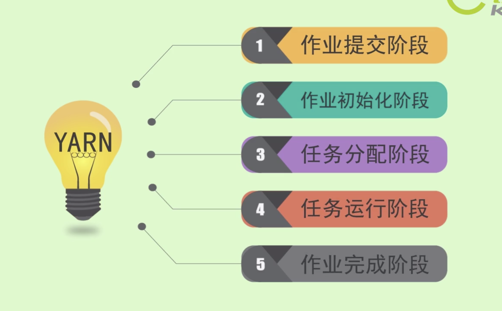
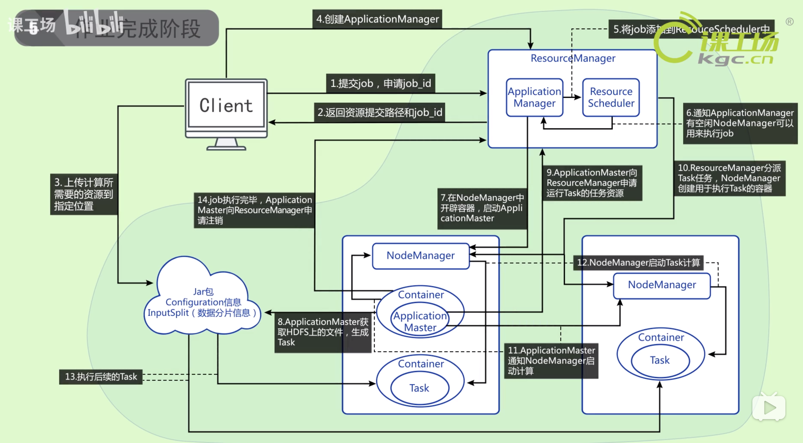
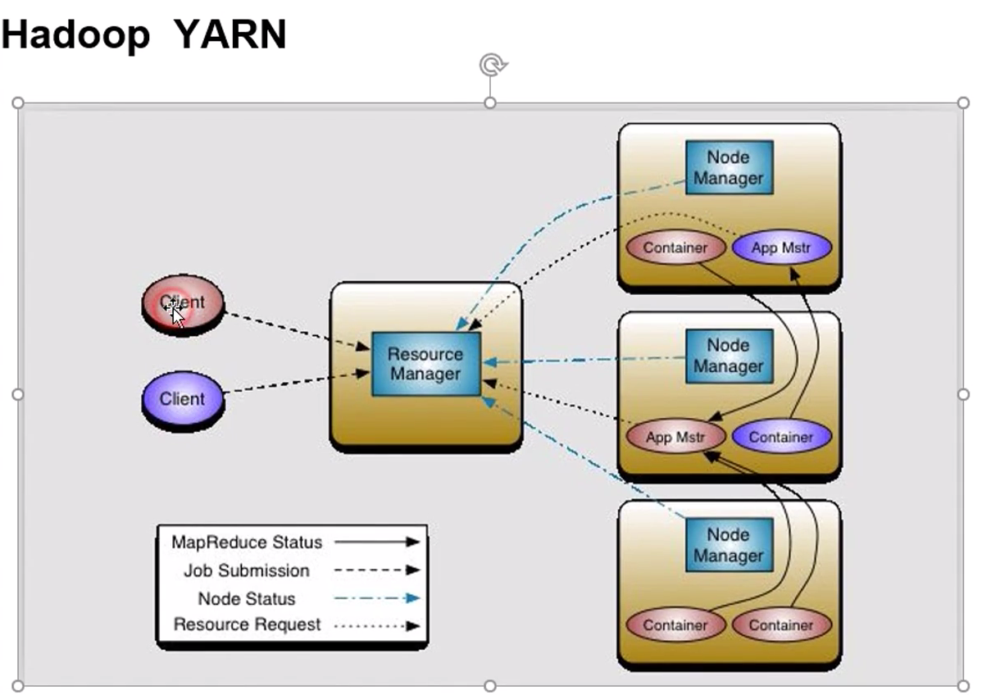
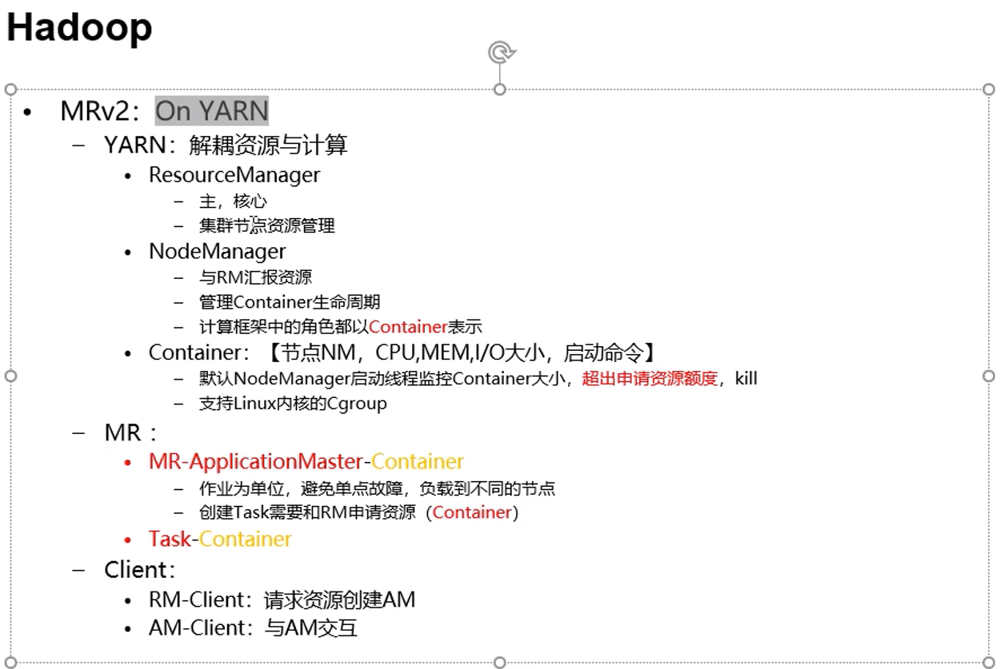

-------

Yarn在MR中的作用：

http://www.sxtbz.com/down/9464.html

NodeManager 和DataNode是一对一的关系。下面 App Master 相当于原来的JobTracker的**调度**的模块。

JobTracker 原来**资源管理**的功能被 ResourceManager 实现了。

ResourceManager 为任务分配 Container 跑服务。

整体上多这么一个客户端就会多一套   App Master  和 Container 。 

HA 如何保障的：   App Master 在一个节点上挂掉之后，ResourceManager会在其他的节点上重启一个  App Master 。

RM 也可以做HA， 使用 zk 协调。

Cgroup可以限制系统的资源的使用情况。

